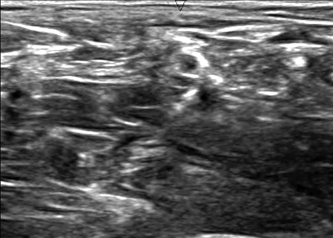
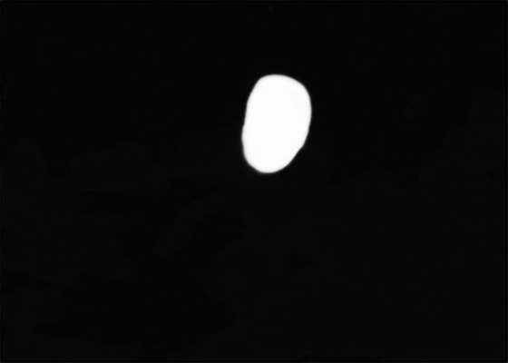

# Implementation of U-Net architecture using Pytorch.

This repository aims to practice pytorch and implement U-net architecture by Ronneberger et al. [1].
The used dataset is nerve ultrasound images and we aim to delineate nerve structures from them.

```
usage: main.py [-h] [--workers WORKERS] [--batchSize BATCHSIZE]
               [--niter NITER] [--start_epoch START_EPOCH] [--lr LR] [--cuda]
               [--resume PATH] [--useBN] [--output_name OUTPUT_NAME]
               dataroot

positional arguments:
  dataroot              path to dataset of kaggle ultrasound nerve
                        segmentation

optional arguments:
  -h, --help            show this help message and exit
  --workers WORKERS     number of data loading workers
  --batchSize BATCHSIZE
                        input batch size
  --niter NITER         number of epochs to train for
  --start_epoch START_EPOCH
                        number of epoch to start
  --lr LR               learning rate, default=0.0002
  --cuda                enables cuda
  --resume PATH         path to latest checkpoint (default: none)
  --useBN               enalbes batch normalization
  --output_name OUTPUT_NAME
                        output checkpoint filename
```

## References

- [1] U-net paper: http://lmb.informatik.uni-freiburg.de/people/ronneber/u-net/
- [2] Keras code: https://www.kaggle.com/c/ultrasound-nerve-segmentation
- [3] Dataset: https://www.kaggle.com/c/ultrasound-nerve-segmentation

## To-do

- Do more tests
- Add dice loss (Current loss is just MSEL2 loss)
- U-net 2.0

## Notes

- Batch normalization is more robust than original version.
without BN: (epoch 100, loss 2.056613136175425e-05)
with BN: (epoch 100, loss 9.57660446428635e-07)

## Sample results

To run our pre-trained model, commit:

```python3 main.py data --resume checkpoint_BN.tar --niter 0 --useBN```


Image


Ground truth


Predicted segmentation